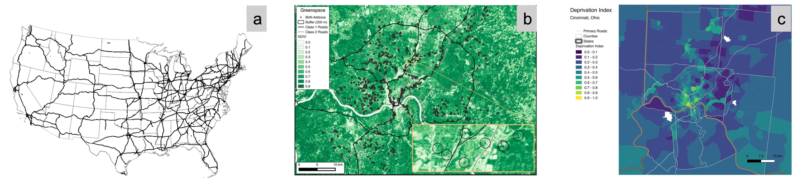
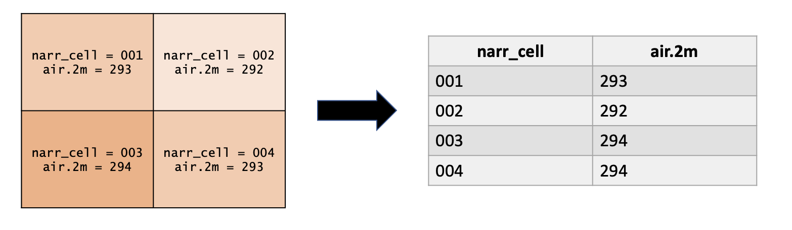
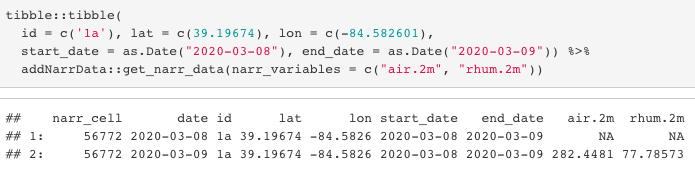
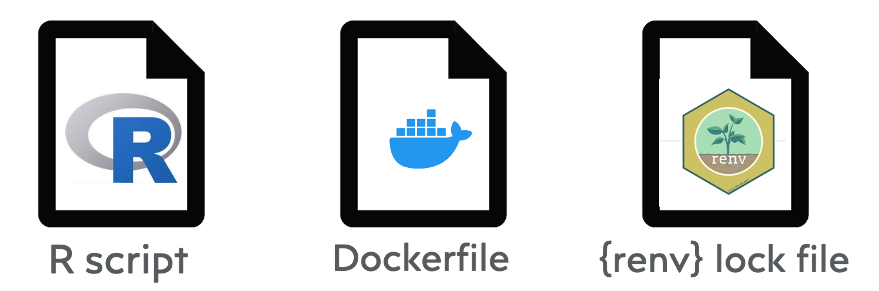

```{r setup, include=FALSE}
knitr::opts_chunk$set(echo = FALSE)
```

# What is Geospatial Data?

- Geospatial data is information about objects or events that have a location on the surface of the earth. For example, census data, weather data, road locations, earthquake events, children living in poverty, the spread of disease, and air pollution exposure are all considered geospatial data. 
- Geospatial data is often temporal, meaning the information is also associated with time. 
- Types of geospatial data include point, line (Figure 1a), gridded (Figure 1b), and polygon (Figure 1c).
```{r fig1, out.width='100%', fig.cap='Types of Geospatial Data', fig.align='center'}

```

# Challenges of Working with Geospatial Data

- Many geospatial datasets are publicly available and free to access. However, most require spatial data expertise to tranform them into a usable dataset. 
- Geospatial datasets can come in a myriad of different file formats that require different software packages and system dependencies.
- Since the earth is a 3D sphere, but we typically work in 2D, geospatial data must be *projected* from 3D to 2D. There are many ways to perform this projection, and these vary by dataset. 
- Some geospatial datasets are very large -- especially spatiotemporal data (e.g. daily gridded exposures). These large files present computational issues, and some are even too large to fit into RAM on a standard computer.
- Because there are so many ways to store and process geospatial data, different users may work with this data differently and get different results, resulting in loss of reproducibility when geospatial data is used downstream in analyses.
- There are added challenges when working with geospatial data in conjunction with health data due to privacy concerns.

# Objective

Here we will describe an example pipeline of how we use R to access and transform geospatial data and create R packages and software containers to make geospatial data accessible and usable for users with varying knowledge of spatial data.

# Example Geospatial Data Pipeline

To illustrate a typical workflow for democratizing a publicly available geospatial dataset, we will walk through an example using weather data from the North American Regional Reanalysis (NARR).

<br>

### Accessing Geospatial Data

- NARR data is publicly available as raster (gridded) files, and contains daily records of 8 different weather variables.
- We used R to programatically download and save the raster files for each weather variable and each year 2000 to 2020

### Transforming Geospatial Data

- Next, to simplify work that would be done repetitively in the future, we performed the spatial calculations up front. Instead of each user having to overlay their data with the NARR raster files, we took the values from the raster along with their accompanying cell identifiers and created a `data.table`. 
```{r fig2, out.width='100%', fig.cap='Raster to data.table', fig.align='center'}

```
- The `data.table` is keyed on `narr_cell` and `date` for faster lookup when joined with an input data file.
- The `data.table` was then broken up and saved as multiple smaller files based on subsets of `narr_cell`s and years. This allows for downloading only necessary subsets of the data, rather than being required to download the data for all years for the entire U.S.
- We then saved the subset data files to an Amazon S3 online repository.

### R Package Development

- To make this data more accessible to R users, we then created an R package that adds NARR data. The package takes an input dataset of locations (`latitude` and `longitude` columns) and date ranges (`start_date` and `end_date` columns), and returns a daily series of NARR weather variables for each location over the given date range.
- This is done by first assigning a `narr_cell` to each location. The work we did when curating the NARR data allows us to do this spatial calculation only once.
- Then the input date range is expanded to a daily time series.
- The combination of `narr_cell` and the date range dictate which subsets of the NARR data are downloaded from the online data repository.
- Finally, downloaded NARR `data.table`s are joined with the input data using the keyed `narr_cell` and `date` variables. 
- Developing this code into an R package allows an R user to access the pre-curated spatial data without specific spatial data knowledge.
```{r fig3, out.width='90%', fig.cap='{addNarrData} example', fig.align='center'}

```

### Container Development

- The final step in democratizing geospatial data is using R and Docker to build a *container*, a platform that wraps software into a complete filesystem containing everything it needs to run.
- This software, called **DeGAUSS**, can be downloaded locally and run without internet connection, which is important for health studies involving private health information.
- The user can input a CSV and the software will return a CSV with the geospatial data appended. 
- The container-based software eliminates the need for any geospatial data or coding expertise, and helps maintain reproducibility by performing the task in the same environment every time.
```{r fig4, out.width='60%', fig.cap='DeGAUSS container components', fig.align='center'}

```

# Summary
The pipeline described here can be adapted to use R to make any geospatial dataset accessible to users with different levels of computing and geospatial data experience. The code accompanying the workflow for NARR data, as well as land cover data, air pollution, greenspace, and more can be found at [https://github.com/geomarker-io](https://github.com/geomarker-io).

**Contact**

 [https://degauss.org](https://degauss.org)

 erika.rasnick@cchmc.org

# References
Kristin Stock, Hans Guesgen. Chapter 10 -- Geospatial Reasoning With Open Data. *Automating Open Source Intelligence*. Syngress, 2016. Pages 171-204. ISBN 9780128029169. [Download.](https://doi.org/10.1016/B978-0-12-802916-9.00010-5.)

Cole Brokamp. DeGAUSS: Decentralized Geomarker Assessment for Multi-Site Studies. *Journal of Open Source Software*. 2018. [Download.](https://colebrokamp-website.s3.amazonaws.com/publications/Brokamp_JOSS_2018.pdf)
